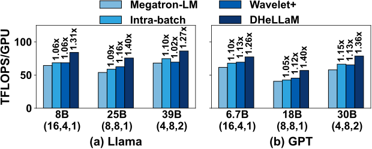
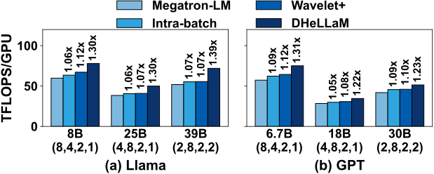
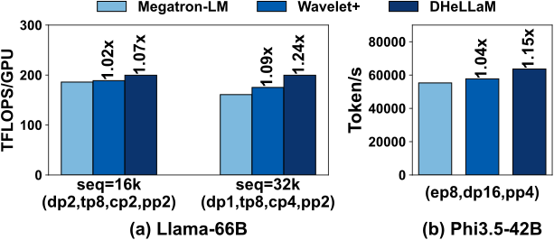

<div align="center">
 
</div>


# DHeLlam Overview
`DHeLlam` enables double-strands interleaving scheduling to accelerate LLM training. You can convert an LLM, such as Llama and GPT using **DSLLM** which is also derived from *torch.nn.module*, allowing it to work with minimal code modifications.


The code of `DHeLlam` mainly includes 4 submodules:
* adaptor: interfaces to help `DHeLlam` be integrated with `Megatron-LM`
* common: some useful tools
* core: execution engine of `DHeLlam`
* operators: fwd and bwd implementation of all operators for LLM

The Overall directory tree of `DHeLlam` is listed as following:
```
.
|-- 3rdparty
|   |-- Megatron-LM
|   `-- flash-attention
|-- csrc
|   |-- operators
|   `-- torchapi.cpp
|-- data
|   `-- llama-data.tar.gz
|-- dhellam
|   |-- _Clib
|   |-- __init__.py
|   |-- adaptor
|   |-- common
|   |-- core
|   `-- operators
|-- docs
|-- micro_benchmark
|-- script
|   `-- run.sh
|-- search
|   |-- config
|   |-- execute.py
|   |-- op_profile_num.txt
|   |-- op_table.py
|   |-- profiler.py
|   |-- search.py
|   `-- search.sh
`-- setup.py
```

# Result

## A40
<div align="center">
 
 
</div>

## A800
<div align="center">
 
</div>


In the following steps, we provide a detailed introduction to help you deploy `DHeLlam` atop `Megatron-LM`.

# Prepare dataset
A light-weight dataset for training Llama locates in `data/`. You can extract it by:
```
tar -zxvf llama-data.tar.gz
```
Then the dataset which can be handled by **Megatron-LM** is collected in `data/llama-data/`.


# Installation
**Requirements**

* torch>=2.3.0
* transformer-engine>=1.4.0
* sentencepiece
* cuda>=12.4

We strongly recommand using *docker* to install `DHeLlam` and run examples. You can download available and public docker images in [NGC](https://catalog.ngc.nvidia.com/orgs/nvidia/containers/pytorch/tags). In this paper, we evalute `DHeLlam` based on the public docker image with the tag of `nvcr.io/nvidia/pytorch:24.03-py3`. 

To support suppot Flash-Attention, the compute capability of NVIDIA GPU must be larger than 8.0, and you can access the following url to check if your device could satisfy the requirements: [NVIDIA GPU Products](https://developer.nvidia.com/cuda-gpus)

## Clone from github
```bash
git submodule sync
git submodule update --init --recursive
```

## DHeLlam
```sh
pip install -e .
```
or
```sh
python setup.py install
```
To reduce compilation time, you can can set the environment variable `MAX_JOBS`,  compiler :
```sh
MAX_JOBS=32 python setup.py install
```
## Megatron
We develop `DHeLlam` atop `Megatron-LM-Corev0.5.0`. All modifications are collected in **megatron.patch** and you can apply it directly by *git apply*.
```sh
cd 3rdparty/Megatron-LM
git checkout -b dhellam
git apply ../../megatron.patch
```

# Usage
## 1-click demo!
We provide an Llama3.1-70B model with 8 layers as a demo, to quickly present the workflow of `DHeLlam` and you can run it by executing `run.sh` in `script/`. 

```sh
cd script
bash run.sh
```

In the first step, `DHeLlam` searches a nearly optimal strategy for operators pairing through profiling and dynamic programming, which would take nearly 5 minutes. Next, the runtime engine of `DHeLlam` takes the strategy and interleaves the fwd pass and bwd pass from different micro-batches.
